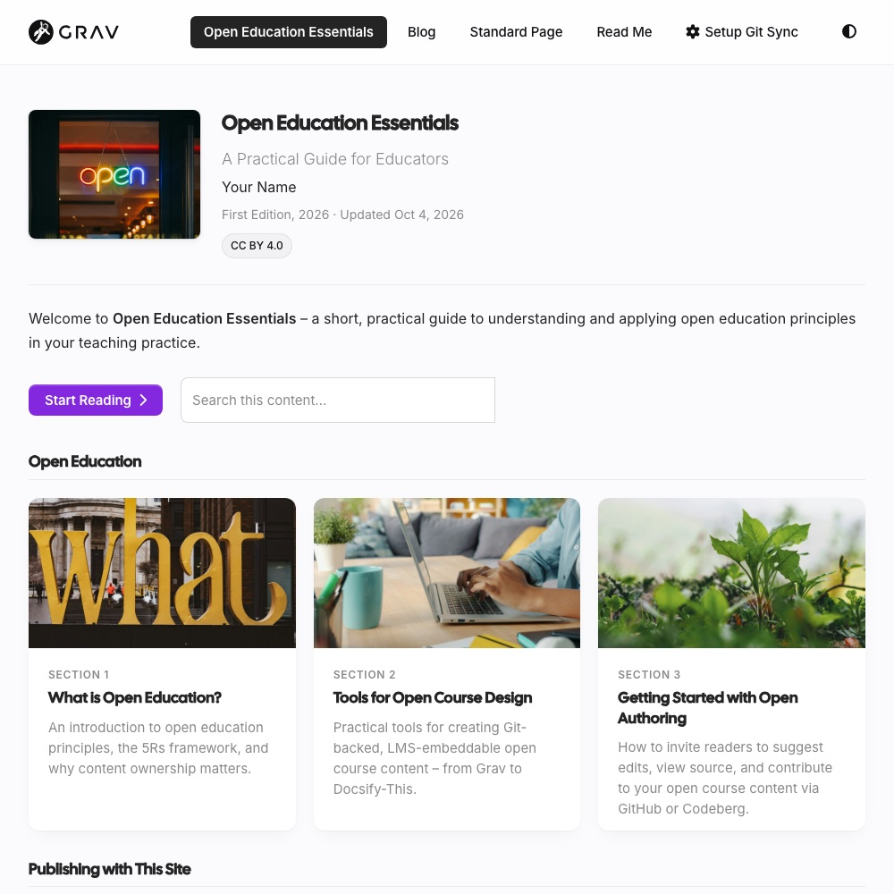

<div align="center">

# 🌐 Quark 2 Open Publishing

### A Quark 2 version of Quark Open Publishing

<p><em>A Grav theme for open guides and blogs – embeddable anywhere, with Git-based open editing built in.</em></p>

[](https://chat.getgrav.org) [](https://github.com/hibbitts-design/grav-theme-quark2-open-publishing/releases/latest) [](LICENSE) [](https://learn.getgrav.org/17/basics/requirements)

<p>A free, open-source child theme of <a href="https://github.com/getgrav/grav-theme-quark2">Quark 2</a>, the default theme of <a href="https://getgrav.org">Grav CMS</a> 2, with Markdown file-based content, a built-in Admin panel, and no database required. It uses the same pages, page settings, shortcodes and theme options as <a href="https://github.com/hibbitts-design/grav-theme-quark-open-publishing">Quark Open Publishing</a>, so the same <a href="https://github.com/hibbitts-design/grav-skeleton-open-publishing-space">Open Publishing Space</a> content works with either theme.</p>



</div>

Quark 2 Open Publishing brings Quark Open Publishing to Quark 2's modern design – its fonts, cards, Light, Dark and Auto modes, accent colour and theme toggle – and adds what open, collaborative guides and blogs need on top: guides with section cards and reading progress, pages that embed cleanly in other systems, and links that open each page's source in your Git repository.

## What Sets It Apart

- **The same content as Quark Open Publishing** – pages, page settings, shortcodes, theme options and page URL parameters are the same, so a site can move between the two themes without changing its content
- **Guides that carry over to Grav Helios Open Reader** – the Section List page type, with section cards, parts, reading progress, Previous/Next navigation, Keep My Place, a last updated date, and OER attribution, using the same page settings as [Grav Helios Open Reader](https://github.com/hibbitts-design/grav-skeleton-helios-open-reader)
- **Built on Quark 2** – its design, blog, hero images, modular pages, and Light, Dark and Auto modes with a theme toggle, used as they are wherever possible
- **Blog extras** – featured posts, a notice above the posts, Continue Reading buttons, reading time, image credits, and a Markdown sidebar page
- **Chromeless display for embedding** – add `/chromeless:true` or `?embedded=true` to any page URL to show only its content, or hide the site menu, sidebar, and footer site-wide
- **Open authoring with Git Sync** – a "View Git Repository" or "View/Edit Page in Git Repository" link in the menu, footer, or page
- **Shortcodes and callouts** – Embedly, Google Slides, H5P, iFrame, Link Preview Card, Markdown File, PDF, SpeakerDeck, and the callout shortcodes (`[objectives]`, `[key-takeaways]` and more), plus GitHub-style alerts
- **Search** – with the SimpleSearch plugin, results grouped by section with the search words highlighted, and a search box on each guide that searches just that guide
- **Open licensing and printing** – Creative Commons license display, OER attribution for guides, and print-friendly pages

## Quark 2 Open Publishing or Quark Open Publishing?

| | Quark 2 Open Publishing | Quark Open Publishing |
|---|---|---|
| Built on | Quark 2 | Quark |
| Grav | 2.1 or newer | 1.7 or 2 |
| Light and Dark modes | Light, Dark and Auto, with a theme toggle for visitors | Off, on, or following the visitor's system setting |
| Content and settings | the same | the same |

Choose Quark 2 Open Publishing for new sites on Grav 2.1 or newer. Quark Open Publishing remains available for sites on Grav 1.7.

## Quick Start

### Installing in an Existing Site
1. Install the [Quark 2](https://github.com/getgrav/grav-theme-quark2) theme (`bin/gpm install quark2`)
2. Download the latest [release](https://github.com/hibbitts-design/grav-theme-quark2-open-publishing/releases/latest), unzip it into `user/themes`, and rename the folder to `quark2-open-publishing`
3. In the Admin Panel, go to **Themes**, select **Quark 2 Open Publishing**, and press **Activate**, or in `user/config/system.yaml` set the theme under `pages`:
   ```yaml
   pages:
     theme: quark2-open-publishing
   ```
4. Clear the Grav cache (`bin/grav clearcache`)

> [!TIP]
> Make your customizations in a child theme, so they are kept when Quark 2 Open Publishing is updated.

### Moving from Quark Open Publishing
Your pages and settings stay as they are:

1. Install Quark 2 and Quark 2 Open Publishing, as above
2. If your site uses a child theme of Quark Open Publishing (such as `mytheme` in the Open Publishing Space skeleton), change it to inherit from Quark 2 Open Publishing: in its PHP file, `extends QuarkOpenPublishing` becomes `extends Quark2OpenPublishing`, and in its `streams` setting, `user/themes/quark-open-publishing` and `user/themes/quark` become `user/themes/quark2-open-publishing` and `user/themes/quark2`. Otherwise, make Quark 2 Open Publishing the default theme
3. Clear the Grav cache (`bin/grav clearcache`)

## Theme Options

All options are available in the Admin Panel under **Themes → Quark 2 Open Publishing**.

- **Open Publishing Options** – chromeless site, H5P setup, Creative Commons license display, and menu dropdowns
- **Quark 2 Options** – Light, Dark or Auto mode by default, accent colour, logos and favicon, header and footer, blog page, and Font Awesome
- **Custom Menu Items** – text, icon, URL, and target for extra menu links
- **Git Sync Link** – location, link type (view or edit), icon and text, and a custom Git repository URL

## Guides, Page URL Parameters and Search

These work the same as in Quark Open Publishing – see its README:

- [Multi-Page Content](https://github.com/hibbitts-design/grav-theme-quark-open-publishing#multi-page-content) – the Section List page type, its settings, and [moving a guide to Grav Helios Open Reader](https://github.com/hibbitts-design/grav-theme-quark-open-publishing#moving-to-grav-helios-open-reader)
- [Page URL Parameters](https://github.com/hibbitts-design/grav-theme-quark-open-publishing#page-url-parameters) – `?embedded=true`, `/chromeless:true`, `?edit_link=false`, and more
- [Search](https://github.com/hibbitts-design/grav-theme-quark-open-publishing#search) – SimpleSearch, or the optional TNTSearch plugin

## Requirements

- PHP >= 8.3
- Grav CMS 2.1 or newer
- The [Quark 2](https://github.com/getgrav/grav-theme-quark2) theme
- Optional: the [SimpleSearch plugin](https://github.com/getgrav/grav-plugin-simplesearch) for search, and the [GitHub Markdown Alerts plugin](https://github.com/trilbymedia/grav-plugin-github-markdown-alerts) for GitHub-style alerts

## Support

### Contact and Support
- Share your feedback in the [Open Publishing Space Survey](https://docs.google.com/forms/d/e/1FAIpQLSeDVXsE1k9mljDvGD687QZO8alchaXqe4dXcIKmnjjWVXatgQ/viewform)
- Follow [@hibbittsdesign@mastodon.social](https://mastodon.social/@hibbittsdesign) on Mastodon for updates
- 👩🏻‍💻🧑🏻‍💻 Join the [Grav Discord](https://chat.getgrav.org) and often find me there
- Add a ⭐️ [star on GitHub](https://github.com/hibbitts-design/grav-theme-quark2-open-publishing) to the Quark 2 Open Publishing project repository
- For bugs or feature requests, [open an issue](https://github.com/hibbitts-design/grav-theme-quark2-open-publishing/issues) on GitHub

### Professional Services

By leveraging his extensive UX design expertise and systems-oriented approach, Paul helps teams and individuals utilize open content in education and publication settings. Professional services include user experience and workflow consulting, premium support subscriptions, workshops, and custom development. Interested? Send a note to [paul@hibbittsdesign.org](mailto:paul@hibbittsdesign.org).

## License

MIT – Hibbitts Design
